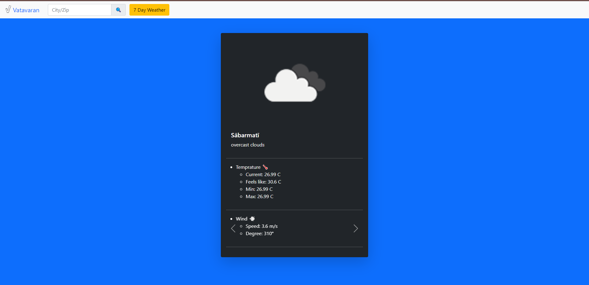
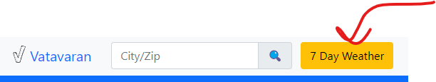
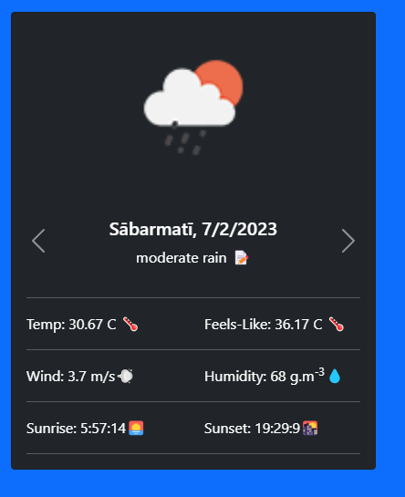
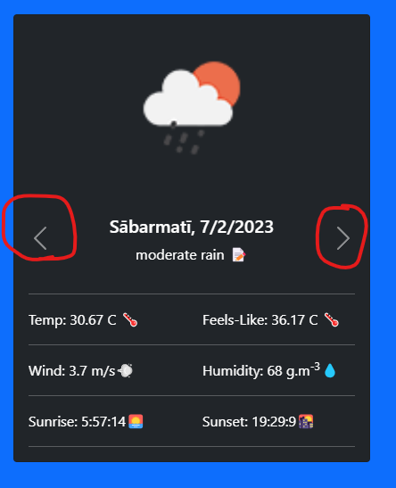
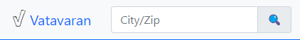
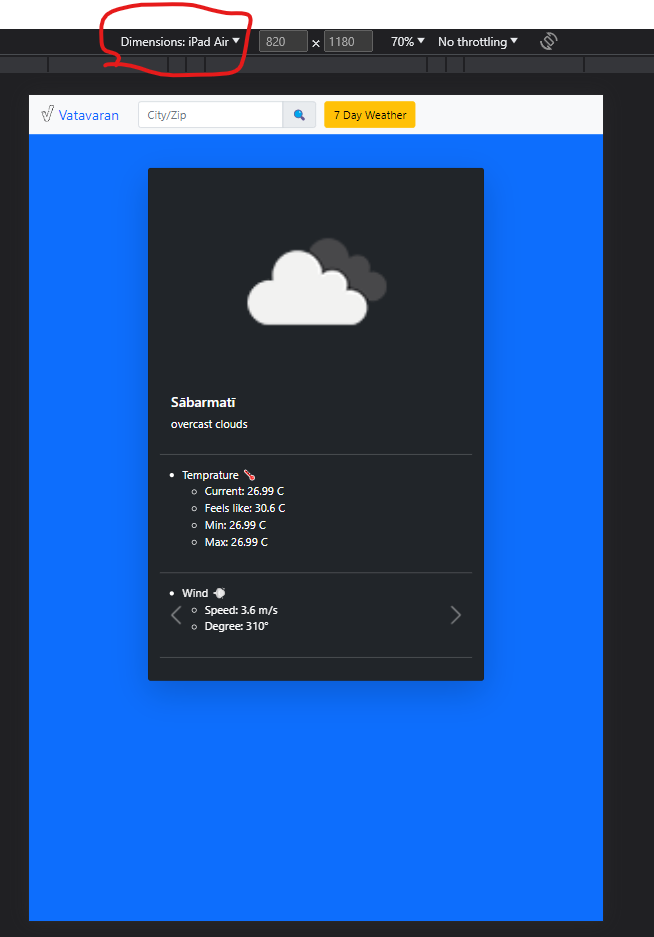

<p align="center">
  <a href="" rel="noopener">
 </a>
</p>

<h3 align="center">Vatavaran</h3>

<div align="center">

[]()

</div>

## 📝 Table of Contents

- [About](#about)
- [Prerequisites](#prerequisites)
- [Setup](#setup)
- [Usage/Features](#usage)
- [Built Using](#built_using)
- [Authors](#authors)

## 🧐 About <a name = "about"></a>

This project is a weather showing application developed using React.js. The app provides weather information for today and the next 7 days based on the user's input. Users can search for weather data by city name or pincode.

## 🏁 Prerequisites <a name = "prerequisites"></a>

Before we begin with our project, we would like you to know the prerequisites for the same so you can understand it.  
We have made our project using :

1. Node.js
2. React.js
3. openweathemap API
4. Bootstrap v5.3

### 🔧 Setup <a name = "setup"></a>

1. Clone the repo.

```sh
https://github.com/shivamkshirsagar11/Weather.git
```
2. Navigate to the project directory
```sh
cd weather
```
3. Install the dependencies
```sh
npm install
```
4. Start the development server
```sh
npm start
```
## 🎈 Usage/Features <a name="usage"></a>

<h3><b>Current Weather:</b> </h3>
<ul><li>The app displays the current weather conditions, including temperature, humidity, wind speed, and weather description.</li>

</ul>

<h3><b>7-Day Forecast:</b> </h3>
<ul><li>Users can view the weather forecast for the next 7 days, providing a glimpse of the expected weather conditions over the upcoming week.</li>
<li>Click on this Button</li>

<li> Daily Weather Card, shows 7 days of weather after current date</li>

<li>Click on these arrow button to scroll through all 7 day weather</li>

</ul>

<h3><b>Search by City or Pincode:</b> </h3>
<ul><li>The app allows users to search for weather information by entering either the name of a city or a pincode. This flexibility enables users to retrieve accurate weather data for their desired location.</li>
<li><b>Search without any Spaces between and/or after city name/pincode, it probably will give error</b></li>

</ul>

<h3><b>Responsive Design:</b> </h3>
<ul><li>The app is built with a responsive design, ensuring that it adapts and provides an optimal viewing experience across various devices and screen sizes.</li>

</ul>

## ⛏️ Built Using <a name = "built_using"></a>

- [React.js](https://react.dev/)
- [Node.js](https://nodejs.org/en/about/)
- [Bootstrap v5.3](https://getbootstrap.com/docs/5.3/getting-started/introduction/)
- [openweathermap API](https://openweathermap.org/api)

## ✍️ Authors <a name = "authors"></a>

- [@shivamkshirsagar11](https://github.com/shivamkshirsagar11)
